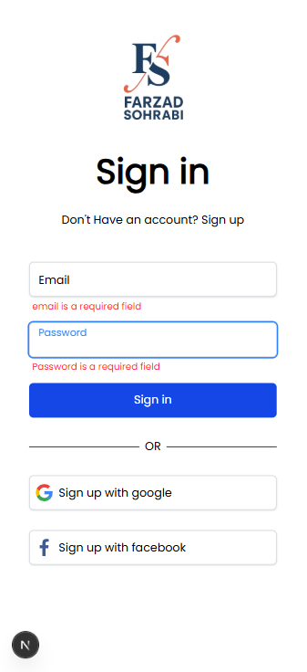
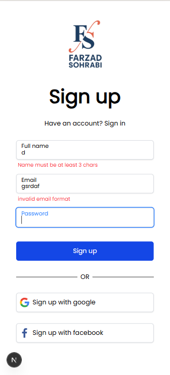

# 🔐 Auth System (Login & Sign Up)

A responsive **authentication system** built with Next.js, featuring **Sign Up** and **Login** pages.  
Includes **form validation**, **responsive design**, and **modern UI** using TailwindCSS.

---

## 🚀 Features
- 🔑 Sign Up & Login forms  
- ✅ Form validation with Yup  
- 🎨 Responsive design with TailwindCSS  
- 🔄 Reusable form components  
- 📱 Mobile-first approach  

---

## 🛠️ Technologies
- [Next.js](https://nextjs.org/) – React framework with SSR & routing  
- [React](https://reactjs.org/) – UI library  
- [Tailwind CSS](https://tailwindcss.com/) – Utility-first CSS framework  
- [Formik](https://formik.org/) – Form handling library  
- [Yup](https://github.com/jquense/yup) – Schema validation  

---

## 📸 Screenshots

- **Login Page**  
  

- **Sign Up Page**  
  


---


## ⚡ Getting Started

Clone the repo and install dependencies:

```bash
git clone https://github.com/YOUR_USERNAME/YOUR_REPO_NAME.git
cd YOUR_REPO_NAME
npm install
npm run dev
